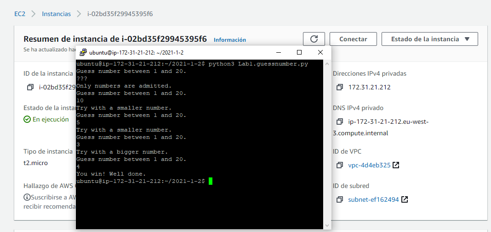

# Lab session #1: Basic "Knowledge Toolbox" to get started in the Cloud

## About

**Course**  
Cloud Computing and Big Data Analytics  (CCBDA-MIRI)  
FIB - Universitat Politècnica de Catalunya. BarcelonaTech  
February 2021

**Team**  
* Axel Wassington
<axel.wassington@estudiantat.upc.edu>
* Marcel Cases
<marcel.cases@estudiantat.upc.edu>

## Task 1.7

Execute the program `Lab1.guessnumber.py` in your AWS instance. Take a screenshot of the terminal window that are you using as proof.
Include that screenshot in your local repository, on your laptop, with the name `Lab1.AWSterminal.png`.
Update your `README.md` file to make that screenshot appear.

For this point we created a **EC2** instance with **Ubuntu** operationg system (Free tire). Then, using **Putty** ssh client and the private key (private key had to be transformed using **Puttygen**) downloaded at the moment of the instance creation, we connected to the instance, cloned the repo and runned the progam usnig the allready installed **Python3** runtime.

## Task 1.9

Create an S3 bucket and synchronize your repository there. Take a screenshot of the browser window showing your S3 bucket. 
Include that screenshot in your local repository, on your laptop, with the name Lab1.S3Bucket.png. Update your README.md file to make that screenshot appear.

For this point we crated a **S3** bucket and through the **AWS Console** uploaded the content of the repository from our local machine.

## Questions

**How long have you been working on this session? What have been the main difficulties you have faced and how have you solved them?**

We have been working around 4 hours.
We didn't understand what point 1.10 ment at first, we thought we should do some kind of synchronization between the repository and the storage. Later we just uploaded the content of the repository into the AWS storage.

## Conclusion summary
In this introductory session, we have worked with some tools that we will be using during the course. First off, the **Python** environment and **Anaconda**, an environment for large-scale data processing, predictive analysis and scientific computing. We have also got acquinted to **Git** and **GitHub** for version control, as well as **Markdown** as the standard coding for the lab report. We have created a template that will be useful for the rest of the reports. After tis local setup, we have joined **Amazon AWS** program to test the script on the cloud. As an example, we have developed a very simple Python game to guess a randomly generated number, for testing purposes on the cloud. We have synched the local repo with an **S3 bucket**. The execution result of this **EC2 instance** on the **AWS terminal** has been successful.
