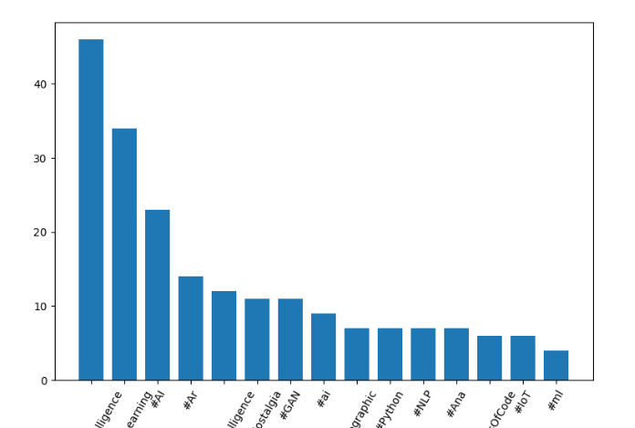
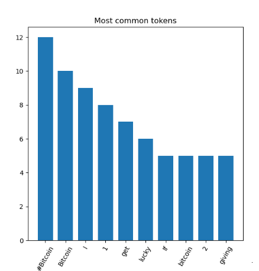
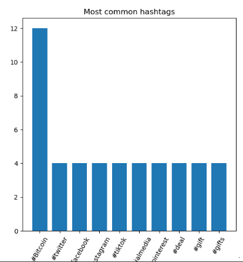
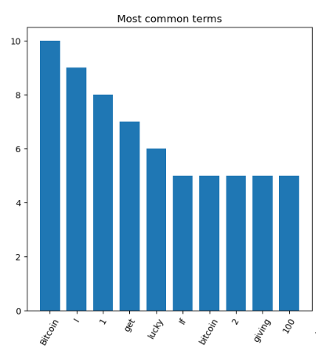

# Lab session #3: Extracting and Analyzing data from the Cloud

## About

**Course**  
Cloud Computing and Big Data Analytics  (CCBDA-MIRI)  
FIB - Universitat Politècnica de Catalunya. BarcelonaTech  
March 2021

**Team**  
* Guillem Bonet
&lt;guillem.bonet@estudiantat.upc.edu&gt;
* Marcel Cases
&lt;marcel.cases@estudiantat.upc.edu&gt;


## Task 3.1: Real-time tweets API of Twitter
We first configure the environment variables to the PyCharm IDE
with ``Python 3.8`` with `Anaconda` we are using. These environment
variables are used for authentication purposes on the Twitter REST API.

We are going to gathers all the new tweets with the "Artificial Intelligence" content
and save it to a ``json`` file and store them in `ArtificialIntelligenceTweets.json`,
for further analysis.

The code is in ``TwitterListener.py``.

## Task 3.2: Analyzing tweets - Counting terms
We use the `json` file from the previous task, which contains data from gathered tweets about a
specific topic to process it.

``ArtificialIntelligenceTweets.json`` contains 138 tweets
downloaded from 19.30 to 19.45 on March the 11th, 2021,
and contain "Artificial Intelligence" in the content.

What we want to do is to preprocess these data in order to capture Twitter-specific aspects
of the text, such as hashtags, mentions and URLs.

We create ``TwitterAnalyzer.py``, a script that prints a list of the top ten most frequent
**tokens**, **hashtags**, and **terms** (skipping mentions and hashtags).

The output of this script is the following:

````
Top 10 tokens:
#ArtificialIntelligence : 46
#MachineLearning : 34
Read : 32
Artificial : 24
@IainLJBrown : 23
#AI : 23
Intelligence : 20
intelligence : 19
AI : 19
artificial : 16

Top 10 hashtags:
#ArtificialIntelligence : 46
#MachineLearning : 34
#AI : 23
#Ar : 14
#artificialintelligence : 12
#DeepNostalgia : 11
#GAN : 11
#ai : 9
#Infographic : 7
#Python : 7

Top 10 terms:
Read : 32
Artificial : 24
Intelligence : 20
intelligence : 19
AI : 19
artificial : 16
New : 14
photos : 13
️ : 12
Networks : 12
````

## Task 3.3: Case study
We count and sort the most commonly used hashtag in
`ArtificialIntelligenceTweets.json` with their frequency,
with the following result:
````
[('#ArtificialIntelligence', 46), ('#MachineLearning', 34), ('#AI', 23), ('#Ar', 14), ('#artificialintelligence', 12), ('#DeepNostalgia', 11), ('#GAN', 11), ('#ai', 9), ('#Infographic', 7), ('#Python', 7), ('#NLP', 7), ('#Ana', 7), ('#100DaysOfCode', 6), ('#IoT', 6), ('#ml', 4)]
````

We use ``matplotlib`` to get a plot of these data:  


The code is in ``CaseStudy.py``.

## Task 3.4: Student proposal
We have created ``StudentProposal.py``, a script that collects
real-time tweets that contain ``Bitcoin`` on it. We analyze
the information they contain, as well as hashtags and mentions.

The file ``BitcoinTweets.json`` contains 51 tweets with this keyword
collected from 19.18 and 19.27 on March 11th, 2021. After
processing the information, we compute the top 10 tokens, 
10 hashtags and 10 terms, as well as the frequency they appear.
The output is the following:

````
Top 10 tokens:
#Bitcoin : 12
Bitcoin : 10
I : 9
1 : 8
get : 7
lucky : 6
If : 5
bitcoin : 5
2 : 5
giving : 5

Top 10 hashtags:
#Bitcoin : 12
#twitter : 4
#facebook : 4
#instagram : 4
#tiktok : 4
#socialmedia : 4
#pinterest : 4
#deal : 4
#gift : 4
#gifts : 4

Top 10 terms:
Bitcoin : 10
I : 9
1 : 8
get : 7
lucky : 6
If : 5
bitcoin : 5
2 : 5
giving : 5
100 : 5
('#Bitcoin', 'Bitcoin', 'I', '1', 'get', 'lucky', 'If', 'bitcoin', '2', 'giving') (12, 10, 9, 8, 7, 6, 5, 5, 5, 5)
('#Bitcoin', '#twitter', '#facebook', '#instagram', '#tiktok', '#socialmedia', '#pinterest', '#deal', '#gift', '#gifts') (12, 4, 4, 4, 4, 4, 4, 4, 4, 4)
('Bitcoin', 'I', '1', 'get', 'lucky', 'If', 'bitcoin', '2', 'giving', '100') (10, 9, 8, 7, 6, 5, 5, 5, 5, 5)
````

We also plot these informaiton as it was previously done, using
``matplotlib``, with the following results:








## Questions
**How long have you been working on this session? What have been the main difficulties you have faced and how have you solved them?**  
We have worked with this laboratory session for around 4 hours.
The main difficulties we faced in the previous lab have not
been a problem here anymore. For instance, the environment
variables have been set up inside PyCharm and not on the OS,
for simplicity.
