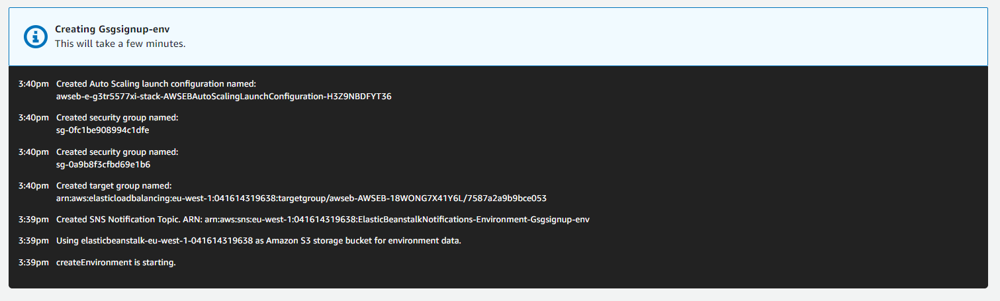

# Lab session #4: Creating a web application using cloud PaaS

## About

**Course**  
Cloud Computing and Big Data Analytics  (CCBDA-MIRI)  
FIB - Universitat Politècnica de Catalunya. BarcelonaTech  
March 2021

**Team**  
* Mariia Borysova
<mariia.borysova@estudiantat.upc.edu>
* Marcel Cases
<marcel.cases@estudiantat.upc.edu>

## Task 4.1: Download the repository for the Web App
We first download ``eb-django-express-signup`` and create a
private repository locally.

## Task 4.2: Create an IAM Policy, Role and User to run the application

Policy is an AWS object that defines permissions of some identity or resource. Role is an identity that has certain permission policies that define what this identity can and cannot do in AWS. IAM Set of permissions that is granted to the IAM User has to be as strict and as small as possible (including only most necessary permissions) to protect an application in case it is compromised.  

We create a new IAM Policy `gsg-signup-policy` that only allows to put
items on the database (`"Action": "dynamodb:PutItem",`).

We also create an IAM role by attaching the previously
created policy and ``AWSElasticBeanstalkWebTier `` (predefined Elastic Beanstalk role that allows the instances in our environment to upload logs to Amazon S3).

We add a user so to we have available an
``Access key ID`` and a ``Secret access key`` to access
the policy.

## Task 4.3: Create a DynamoDB Table
Now we generate a new **DynamoDB** table that will
contain the records of the users that want to join
the emailing list. This table is first created with
a single parameter, ``email``.

## Task 4.4: Test the web app locally
We want to test the app locally. For doing this, we create a Python virtual environment and 
define the environment variables we will need (such
as keys or server location).

After installing ``django`` and ``boto3``, we could test
the app locally.

The server was running at [http://127.0.0.1:8000/](http://127.0.0.1:8000/).


Nonetheless, error appeared:


With the console message:
````
Forbidden: /signup
"POST /signup HTTP/1.1" 403 0
Error connecting to database table: Provided region_name '{region_name}' doesn't match a supported format.Provided region_name '"eu-west-1"' doesn't match a supported format.
````

We solved it by removing " " from the setup of
the environment variables:


Now a green message was shown to the user after registering
properly:

````
Thanks for signing up!
You'll be among the first to know when we launch.
````

With the console message:
````
New item added to database.
"POST /signup HTTP/1.1" 200 0
````

Checking the DynamoDB on AWS, we can see
the new registered email:


Here we are using 2 different types of environments:
**Process environment** which uses the set of environment variables that we set up to the operating system (for login authentication, passwords, ...).
And a **Python environment** which is an independent python install with the minimum packages and dependencies that our application is using.


## Task 4.5: Create the AWS Beanstalk environment and deploy the sample web app
After running ``pip freeze > requirements.txt`` and `pip install -r requirements.txt`, we got
the error message:

````
ERROR: Could not install packages due to an OSError: [Errno 2] No such file or directory: 'C:\\ci\\cffi_1613247279197\\work'
````

The problem was that we did not create a specific
environment for the web app. To solve it, we created
a new virtual environment ``eb-virt`` with
the minimum packages needed, and all run fine.

After running ``pip freeze > requirements.txt`` again on the `eb-virt` environment, only these
packages were specified as requirements:

````python
appdirs==1.4.4
asgiref==3.3.1
boto3==1.17.30
botocore==1.20.30
certifi==2020.12.5
distlib==0.3.1
Django==3.1.7
filelock==3.0.12
jmespath==0.10.0
python-dateutil==2.8.1
pytz==2021.1
s3transfer==0.3.4
six==1.15.0
sqlparse==0.4.1
urllib3==1.26.4
virtualenv==20.4.3
wincertstore==0.2
````

We could install all the needed packages from
``requirements.txt`` properly.

We began the deployment of our application on Beanstalk.
It was configured to run on ``Python 3.8 running on 64bit Amazon Linux 2/3.2.0``.

We chose the preconfigured values:


Regarding **capacity** settings, we changed:


Regarding **security** settings, we had to create an AWS key-pair
by following the instructions on
[https://docs.aws.amazon.com/AWSEC2/latest/UserGuide/ec2-key-pairs.html#prepare-key-pair](https://docs.aws.amazon.com/AWSEC2/latest/UserGuide/ec2-key-pairs.html#prepare-key-pair)

We also had to create a new role named ``aws-elasticbeanstalk-service-role``
on the IAM console, with the following policies
binded:
* AWSElasticBeanstalkEnhancedHealth
* AWSElasticBeanstalkManagedUpdatesCustomerRolePolicy

After that, we could update the security settings as follows:


Regarding **notification** settings, we added a personal
email address to get important notifications from Beanstalk.

Regarding **network** settings, we selected `eu-west-1a`
in both `Load balancer` subnets and `Instance subnets`, but
a warning message appeared:


This is why we had to select `eu-west-1a` and `eu-west-1b`,
assuming the cost the two instances will have.

We also selected `Public IP address` to be able to
access the app from the outside.


We started creating the app according to the previously
settings:



After ~2min, the web app was up and running.


## Task 4.6: Configure Elastic Beanstalk CLI and deploy the target web app

**MacOS**<br>

First of all we had to install the EB CLI with Homebrew using command:
````
$ brew install awsebcli
````
Afterwards we could run following commands in the Python virtual environment and got following outputs:
````
(eb-virt) (base) MacBook-Pro-Mariia:eb-django-express-signup borysova$ eb init

Select a default region
...
4) eu-west-1 : EU (Ireland)
...
(default is 3): 4

Select an application to use
...
2) [ Create new Application ]
(default is 2): 2

Enter Application Name
(default is "eb-django-express-signup"): 
Application eb-django-express-signup has been created.

It appears you are using Python. Is this correct?
(Y/n): y

Select a platform branch.
1) Python 3.8 running on 64bit Amazon Linux 2
2) Python 3.7 running on 64bit Amazon Linux 2
3) Python 3.6 running on 64bit Amazon Linux
(default is 1): 3

Do you wish to continue with CodeCommit? (Y/n): n
Do you want to set up SSH for your instances?
(Y/n): n

````
Thus, the container was initialized and afterwards we created an environment for the application
````
(eb-virt) (base) MacBook-Pro-Mariia:eb-django-express-signup borysova$ eb create --service-role aws-elasticbeanstalk-service-role  --elb-type classic --vpc.elbsubnets eu-west-1a --envvars DEBUG=True,STARTUP_SIGNUP_TABLE=gsg-signup-table,AWS_REGION=eu-west-1,AWS_ACCESS_KEY_ID=<ID>,AWS_SECRET_ACCESS_KEY=<KEY>
Enter Environment Name
(default is eb-django-express-signup-dev): eb-django-express-signup-dev
Enter DNS CNAME prefix
(default is eb-django-express-signup-dev2): eb-django-express-signup-dev
That cname is not available. Please choose another.
Enter DNS CNAME prefix
(default is eb-django-express-signup-dev): eb-django-express-signup-dev-1


Would you like to enable Spot Fleet requests for this environment? (y/N): n
Creating application version archive "app-4b25-210322_232036".
Uploading eb-django-express-signup/app-4b25-210322_232036.zip to S3. This may take a while.
Upload Complete.
Environment details for: eb-django-express-signup-dev
  Application name: eb-django-express-signup
  Region: eu-west-1
  Deployed Version: app-4b25-210322_232036
  Environment ID: e-2wemy3i5pt
  Platform: arn:aws:elasticbeanstalk:eu-west-1::platform/Python 3.6 running on 64bit Amazon Linux/2.9.19
  Tier: WebServer-Standard-1.0
  CNAME: eb-django-express-signup-dev-1.eu-west-1.elasticbeanstalk.com
  Updated: 2021-03-22 22:20:41.573000+00:00
Printing Status:
2021-03-22 22:20:40    INFO    createEnvironment is starting.
2021-03-22 22:20:41    INFO    Using elasticbeanstalk-eu-west-1-277386209534 as Amazon S3 storage bucket for environment data.
2021-03-22 22:21:01    INFO    Created security group named: sg-06e53bb5e36232e65
2021-03-22 22:21:17    INFO    Created load balancer named: awseb-e-2-AWSEBLoa-1F08UP7UGBCNV
2021-03-22 22:21:17    INFO    Created security group named: awseb-e-2wemy3i5pt-stack-AWSEBSecurityGroup-106KM843VRNKM
2021-03-22 22:21:17    INFO    Created Auto Scaling launch configuration named: awseb-e-2wemy3i5pt-stack-AWSEBAutoScalingLaunchConfiguration-5DQ5TJWRDM4P
2021-03-22 22:22:20    INFO    Created Auto Scaling group named: awseb-e-2wemy3i5pt-stack-AWSEBAutoScalingGroup-E1YDQUQ6CPVZ
2021-03-22 22:22:20    INFO    Waiting for EC2 instances to launch. This may take a few minutes.
2021-03-22 22:22:20    INFO    Created Auto Scaling group policy named: arn:aws:autoscaling:eu-west-1:277386209534:scalingPolicy:6c87cfb0-b8ad-4e92-96eb-fe7c9eaa7d70:autoScalingGroupName/awseb-e-2wemy3i5pt-stack-AWSEBAutoScalingGroup-E1YDQUQ6CPVZ:policyName/awseb-e-2wemy3i5pt-stack-AWSEBAutoScalingScaleUpPolicy-157G8ZGCDZ0RY
2021-03-22 22:22:20    INFO    Created Auto Scaling group policy named: arn:aws:autoscaling:eu-west-1:277386209534:scalingPolicy:af22f1a8-382c-4a7d-afd0-d05a597c0146:autoScalingGroupName/awseb-e-2wemy3i5pt-stack-AWSEBAutoScalingGroup-E1YDQUQ6CPVZ:policyName/awseb-e-2wemy3i5pt-stack-AWSEBAutoScalingScaleDownPolicy-22DCEQHP2VYP
2021-03-22 22:22:20    INFO    Created CloudWatch alarm named: awseb-e-2wemy3i5pt-stack-AWSEBCloudwatchAlarmHigh-661ADU0Q3VVC
2021-03-22 22:22:20    INFO    Created CloudWatch alarm named: awseb-e-2wemy3i5pt-stack-AWSEBCloudwatchAlarmLow-15CREIRPM9F7B
2021-03-22 22:22:35    ERROR   Your WSGIPath refers to a file that does not exist.
2021-03-22 22:23:50    INFO    Successfully launched environment: eb-django-express-signup-dev
````

Application code has been uploaded and environment was launched. However, application did not work because of the **ERROR   Your WSGIPath refers to a file that does not exist.**. We changed WSGIPath from **application.py** to **eb-django-express-signup/wsgi.py**
Now after running
````
(eb-virt) (base) MacBook-Pro-Mariia:eb-django-express-signup borysova$ eb open
````
in Pycharm console, application was opened in a browser.

We interacted with an application and checked that it worked properly and new records were stored in DynamoDB database.


We also tried to create the environment with a single instance, with no load-balancer. For doing so we had to delete options ``--elb-type classic --vpc.elbsubnets eu-west-1a`` and add ``--single``.
Thus, obtained command looked as follows:
````
(eb-virt) (base) MacBook-Pro-Mariia:eb-django-express-signup borysova$ eb create --service-role aws-elasticbeanstalk-service-role  --single --envvars DEBUG=True,STARTUP_SIGNUP_TABLE=gsg-signup-table,AWS_REGION=eu-west-1,AWS_ACCESS_KEY_ID=<ID>,AWS_SECRET_ACCESS_KEY=<KEY>
````


## Questions

Go to your EC2 console and check the EC2 instance that AWS uses for the Elastic Beanstalk environment. Terminate the instance. Check what happens in your EB console. Wait a couple of minutes and check again your EC2 console.

**Q45a: What has happened? Why do you think that has happened?**

Let's take a look into an instance **eb-django-express-signup-test-1**.


We terminated this instance via EC2 console.


However, there were no output in the EB console.


And after refreshing an EC2 console **eb-django-express-signup-test-1** was terminated, however a new ****eb-django-express-signup-test-1**** running instance appeared.


Thus, we can conclude that an environment has not been terminated.

Now, to save expenses, we can terminate our environment, this time from the EB console.

**Q45b: What has happened? Why do you think that has happened? Check both EC2 and EB consoles.**

Now we terminated an instance using EB console:


Termination was successful and an instance in EC2 console was terminated as well:


**Q45c: Can you terminate the application using the command line? What is the command? if it exists.**

There is a command ``eb terminate --all`` that is used to deletes the application that the current directory was initialized to using ``eb init``. The command terminates all environments in the application, terminates the application's application versions and saved configurations, and then deletes the application. However, as far as we found out, it is not possible to terminate an application using a console command.

**Q45d: What parameters have you added to the ``eb create command`` to create your environment? Explain why you have selected each parameter.**
``--service-role aws-elasticbeanstalk-service-role`` Was selected to assign previously created non-default service role (IAM role that Elastic Beanstalk assumes when calling other services on our behalf) aws-elasticbeanstalk-service-role to the environment.
``--elb-type classic`` To select type of the load balancer. Load balancer is used to distribute traffic between created environment's instances. Classic Load Balancer routes HTTP, HTTPS, or TCP request traffic to different ports on environment instances.
``--vpc.elbsubnets eu-west-1a`` specifies subnets for the Elastic Load Balancing load balancer. In this case we specified only eu-west-1a subnet
``--envvars`` is used to specify environment properties such as DEBUG, STARTUP_SIGNUP_TABLE, AWS_REGION, AWS_ACCESS_KEY_ID and AWS_SECRET_ACCESS_KEY

**Q46: How long have you been working on this session? What have been the main difficulties you have faced and how have you solved them?**

We spent 2 hours during a lab session on Wednesday and then each of us spent approximately 5 hours to finish an assignment. Mariia also had a short meeting with Prof. Toribio Gonzalez after the lecture on Monday to discuss problems with an assignment.
All of the problems that we faces were described in the previous sections. However, there were one more problem with a step 4.5. While creating an environment following  the tutorial, a warning "Environment health has transitioned from Pending to Warning. Initialization in progress (running for 3 minutes). There are no instances. Unable to assume role "arn:aws:iam::277386209534:role/aws-elasticbeanstalk-service-role" was constantly appearing. We tried to change a Python version, load-balancer settings, create new environments from the scratch etc.  Unfortunately, it did not help to remove a warning. However, an application could be launched even with a warning during the set up so we decided just to ignore it. 


In this assignment we learnt ho we could use and configure Elastic Beanstalk to launch a scalable web application. We learnt some basics of Identity and Access management (IAM) to ensure security of our application. We also interacted with DynamoDB to store an entries in a database. Finally, we launched our app from the EB Console both using browser and a Pycharm. 

**Additional screenshot of the DynamoDB database**


