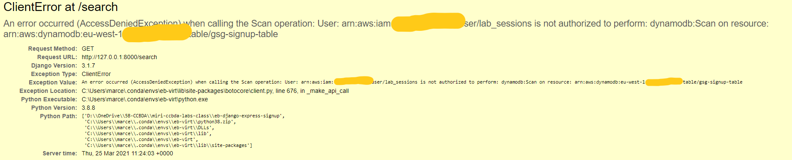
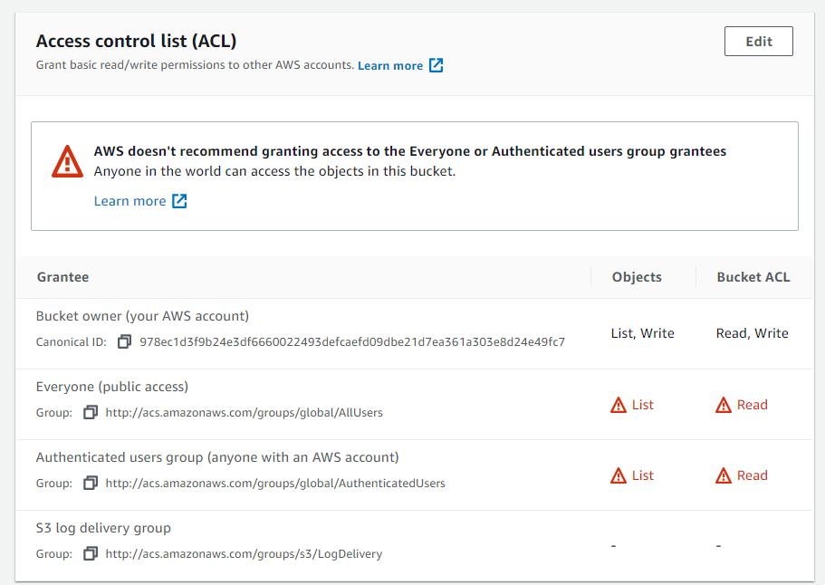

# Lab session #5: Enhancing your web app using additional cloud services

## About

**Course**  
Cloud Computing and Big Data Analytics  (CCBDA-MIRI)  
FIB - Universitat Politècnica de Catalunya. BarcelonaTech  
March 2021

**Team**  
* Marc Catrisse
&lt;marc.catrisse@estudiantat.upc.edu&gt;
* Marcel Cases
&lt;marcel.cases@estudiantat.upc.edu&gt;


## Pre-lab
We create a new user for this session to avoid using the master account credentials, that provide access to all services
and resources.


From now on, we will be using the credentials of this new
user to do all the work related.


## Task 5.1: Use AWS Simple Notification Service in your web app

We first create a new _AWS SNS Topic_ and a subscriber to this topic, that will 
notify via mail everytime a new message it's posted in the topic, in our use case will be 
when a new user joins the waiting list on the web app.


So, because our program will send SNS messages to the previously created topic, 
we need to set a new environment variable, indicating the ARN of the SNS Topic

````bash
set NEW_SIGNUP_TOPIC=arn:aws:sns:eu-west-1:XXXXX:gsg-signup-notifications
````

We modify the code of the web application by adding the following chunk to ``form/models.py``, 
that send notifications using the `sns.publish()` api function

````python
NEW_SIGNUP_TOPIC = os.environ['NEW_SIGNUP_TOPIC']

def send_notification(self, email):
    sns = boto3.client('sns', region_name=AWS_REGION)
    try:
        sns.publish(
            TopicArn=NEW_SIGNUP_TOPIC,
            Message='New signup: %s' % email,
            Subject='New signup',
        )
        logger.error('SNS message sent.')

    except Exception as e:
        logger.error(
            'Error sending AWS SNS message: ' + (e.fmt if hasattr(e, 'fmt') else '') + ','.join(e.args))
````

We go to `form/views.py` and modify the signup view, so if the lead has been correctly inserted in our DynamoDB table 
the program will send a notification.

````python
def signup(request):
    leads = Leads()
    status = leads.insert_lead(request.POST['name'], request.POST['email'], request.POST['previewAccess'])
    if status == 200:
        leads.send_notification(request.POST['email'])
    return HttpResponse('', status=status)
````
Notice that, now our program will publish some SNS messages, requiring the corresponding 
`sns.Publish` permission. We will add it via IAM console, modifying `gsg-signup-policy` as follows:


After that, we run the modified code of the new app locally by running `python manage.py runserver` and, 
after adding a new user to the waiting list, we receive the following notification:


We also make sure that the new record appears on the _DynamoDB_ table we had created in previous sessions.
Verifying that the webApp is still working as expected

After that, we commit all changes and deploy the app to Elastic Beanstalk.

**Q51: Has everything gone alright?**  

Not at the first deployment. We had to modify the `WSGIPath` to `eb-django-express-signup/wsgi.py`.
After saving changes and making sure that all environment variables were set (including the new ``NEW_SIGNUP_TOPIC``), the
environment started an update with these new data, and everything run fine and the notification was received.


The Health of the Elastic Beanstalk environment is reported as Ok:


## Task 5.2: Create a new option to retrieve the list of leads

We want to create a menu option to retrieve the list of leads.
For this, we modify the source code of the web app as follows:
* On `form/urls.py` we add `# ex: /search    path('search', views.search, name='search')`
to add the new URL
* On `form/views.py` we add a `search(request)` definition that renders the list of people who registered
* On `form/models.py` we add a `get_leads(self, domain, preview)` definition that handles the request with the _DynamoDB_ and allows us to filter values
* We add the file `search.html` to `form/templates` to create the HTML results. We add a new option to the menu bar by modifying this HTML file

We are ready to test our modifications locally.

**Q52: Has everything gone alright? What have you changed?**  
At the first run, the app booted properly but the new created link ``Admin search`` returned an error:



The problem was in the IAM `gsg-signup-policy`. To solve it, 
we went to `IAM Management Console` on the web and added an action to the
JSON file `dynamodb:Scan`:


After that, we relaunched the app locally and we could successfully retrieve the
list from the database:


We deployed the app on _Elastic Beanstalk_, we modified the path to `wsgi.py` again
and everything run as expected.


## Task 5.3: Improve the web app transfer of information (optional)
In this task, we will try to improve the above code in charge to get the number of mails associated to each domain.
Actually, everytime we access to /search, all entries of all domains are being loaded into the system, and then we iterate
over each one of them in order to get the number of emails per domain
````python
def search(request):
    domain = request.GET.get('domain')
    preview = request.GET.get('preview')
    leads = Leads()
    items = leads.get_leads(domain, preview)
    if domain or preview:
        return render(request, 'search.html', {'items': items})
    else:
        domain_count = Counter()
        domain_count.update([item['email'].split('@')[1] for item in items])
        return render(request, 'search.html', {'domains': sorted(domain_count.items())})
````
As DynamoDB is a NoSQL database and don't permit group by queries, we decided to change the way we are storing the data.
So now, instead of just save a single email, we are storing a more complex object using domain as `partition key`

````json
{
  "domain": {
    "S": "gmail.com"
  },
  "contador": {
    "N": "3"
  },
  "emails": {
    "L": [
      {
        "M": {
          "name": {
            "S": "Marc Catrisse"
          },
          "preview": {
            "S": "Yes"
          },
          "email": {
            "S": "markittos1@gmail.com"
          }
        }
      }
    ]
  }
}
````

Now, everytime we are updating the emails list per each domain, we will also increase the `contador` attribute, 
which we will query later for getting the number of emails per domain, without having to query all the emails.
Below there is the new insert function that uses `update_item` function. (Notice that some irrelevant code is missing)
````python
....
response = table.update_item(
    Key={
        'domain': domain
    },
    UpdateExpression='SET #emails = list_append(if_not_exists(#emails, :empty_list), :c) ADD #contador :q',
    ExpressionAttributeNames={
        '#emails': 'emails',
        '#contador': 'contador'
    },
    ExpressionAttributeValues={
        ':c': [
            {'name': name, 'email': email, 'preview': previewAccess}
        ],
        ':empty_list': [],
        ':q': 1
    },
    ReturnValues='UPDATED_NEW',
)
....
````
With this modification we can now easily get the number of emails per domain
````python
def get_count_by_domain(self):
    try:
        dynamodb = boto3.resource('dynamodb', region_name=AWS_REGION)
        table = dynamodb.Table(STARTUP_SIGNUP_TABLE)
    except Exception as e:
        logger.error(
            'Error connecting to database table: ' + (e.fmt if hasattr(e, 'fmt') else '') + ','.join(e.args))
        return None

    response = table.scan(
        Select='SPECIFIC_ATTRIBUTES',
        AttributesToGet=[
            'domain',
            'contador'
        ],
        ReturnConsumedCapacity='TOTAL',
    )
    if response['ResponseMetadata']['HTTPStatusCode'] == 200:
        return response['Items']
    logger.error('Unknown error retrieving items from database.')
    return None
````

But, this solution is not perfect. When trying to adapt the `get_leads` function we couldn't find a way to filter the 
emails list of each domain, so we had to manually do the `preview` filter after the query/scan.

````python
def get_emails_from_domain(self, domain):
    try:
        dynamodb = boto3.resource('dynamodb', region_name=AWS_REGION)
        table = dynamodb.Table(STARTUP_SIGNUP_TABLE)
    except Exception as e:
        logger.error(
            'Error connecting to database table: ' + (e.fmt if hasattr(e, 'fmt') else '') + ','.join(e.args))
        return None
    if domain:
        response = table.query(KeyConditionExpression=Key('domain').eq(domain))
    else:
        response = table.scan()

    if response['ResponseMetadata']['HTTPStatusCode'] == 200:
        return response['Items']
    logger.error('Unknown error retrieving items from database.')
    return None
````
````python
def search(request):
    domain = request.GET.get('domain')
    preview = request.GET.get('preview')
    leads = Leads()

    if domain or preview:
        items = leads.get_emails_from_domain(domain)
        # Filter preview manually not cool...
        emails = []
        for item in items:
            emails.extend(item['emails'])
        for email in emails:
            if bool(preview) != bool(email['preview']):
                emails.remove(email)

        return render(request, 'search.html', {'items': emails})
    else:
        res = leads.get_count_by_domain()
        return render(request, 'search.html', {'domains': res})
````
With this modification the application is still working and it's a bit more efficient.

For more info you can check out the webApp repo: https://github.com/TheMatrix97/eb-django-express-signup/tree/lab5


## Task 5.4: Deliver static content using a Content Delivery Network

**Q54: Take a couple of screenshots of you S3 and CloudFront consoles to demonstrate that everything worked all right.**

All the static files of the website are uploaded to a _AWS S3
Bucket_, using aws cli, to later be served through a CDN:
````shell
$ aws s3 sync --acl public-read ./static s3://eb-django-express-signup-041614319638
upload: static\custom.css to s3://eb-django-express-signup-041614319638/custom.css
upload: static\CCBDA-Square.png to s3://eb-django-express-signup-041614319638/CCBDA-Square.png
upload: static\favicon.ico to s3://eb-django-express-signup-041614319638/favicon.ico
upload: static\startup-bg.png to s3://eb-django-express-signup-041614319638/startup-bg.png
````


After uploading them, we grant permissions so that they
can be accessed from everywhere, without the need to be logged in:



Now we create a new distribution on _AWS CloudFront_, this way this static content that we just uploaded, will
be served using a CDN, approaching the content to the requester and hence reducing latency.


Now, we will modify the code in order to use the newly created CDN. By
modifying the following line on `/templates/generic.html`, the custom.css and all images associated inside will be 
obtained from the CDN.
````HTML
<link href="https://d1zxcgbdswb1v8.cloudfront.net/custom.css" rel="stylesheet">
````
Finally, we deploy the app on _Elastic Beanstalk_ and make sure
everything works fine. When we check the source of the information
on Google Chrome, we see the following:


This means that all the static content is served from 
the CDN.

**Q55: How long have you been working on this session (including the optional part)? What have been the main difficulties that you have faced and how have you solved them?**

We have worked with this session for around 10 hours, and the
main difficulty has been Task 5.3, as we had to go in deep in DynamoDB documentation, so we spend 3 hours more or less...

