# Lab session #6: Programming your cloud infrastructure

## About

**Course**  
Cloud Computing and Big Data Analytics  (CCBDA-MIRI)  
FIB - Universitat Politècnica de Catalunya. BarcelonaTech  
April 2021

**Team**  
* Natalia Moszczynska
&lt;natalia.moszczynska@estudiantat.upc.edu&gt;
* Marcel Cases
&lt;marcel.cases@estudiantat.upc.edu&gt;

## Task 6.1: Bootstrap the creation of your web server
Following the instructions, we have set up the web server.
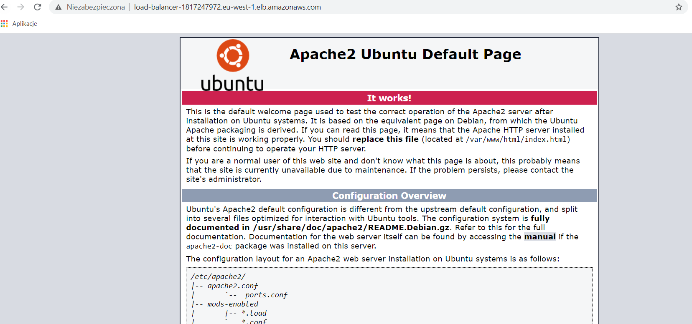

Then we modified the code so it displays the id of the instance.
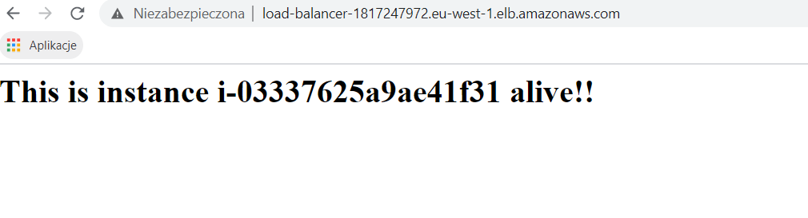

Later on, we have set up the autoscaling group and 3 instances started to work.
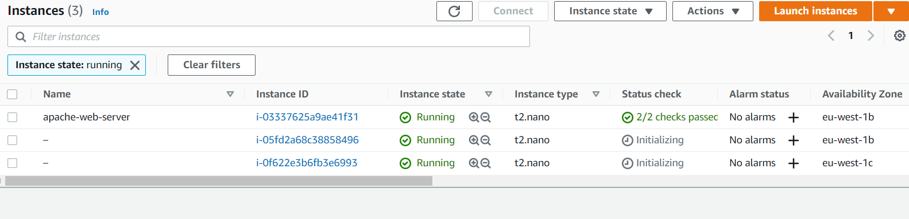

Now refreshing the website, we can see instance id changing.
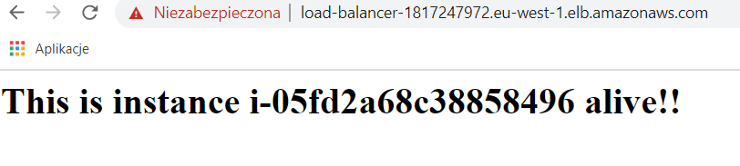
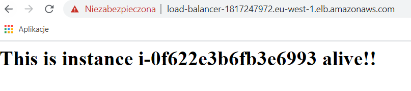


**Q611 What happens when you use https://your-load-balancer-url instead of http://your-load-balancer-url ? Why does that happen? How could you fix it?**
We can still connect to the website - there is a communicate about unsecure connection as certificate is not trusted. To fix it, we have to install the certificate in trusted root certification authorities store.

**Q612 Stop all three EC2 instances and wait aprox. 5 minutes. What happens? Why?**
When stopping instances, we get warning 
````
The following instances are attached to an Auto Scaling group:
i-05fd2a68c38858496 (web-server-auto-scaling-group)
i-0f622e3b6fb3e6993 (web-server-auto-scaling-group)
If you stop the instances, Amazon EC2 Auto Scaling might launch replacement instances automatically. If you do not want Amazon EC2 Auto Scaling to launch replacement instances, first detach the instances from the Auto Scaling group.
````
After 5 minutes, two new instances were created.
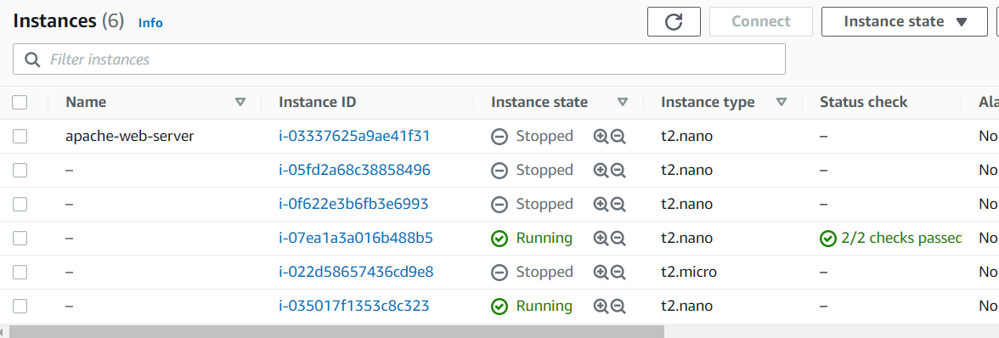
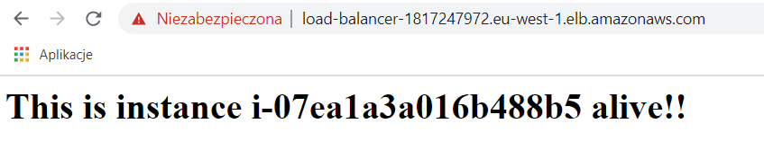
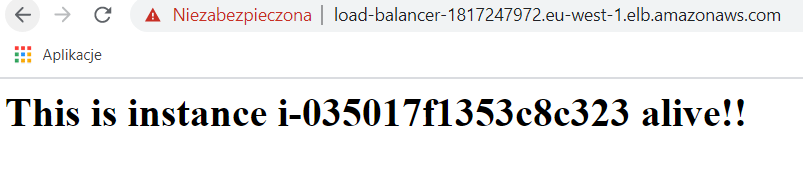

They took over the responsabilities - now they are hosting the server and their id are visible at the website.

It happens because of belonging to the autoscaling group which launches new instances when the other ones are stopped or terminated.

**Q613. Terminate all three EC2 instances and wait aprox. 5 minutes. What happens? Why?**
No changes happened - as two instances which were created after stopping instances are active. Because of that there was no need to create new ones.
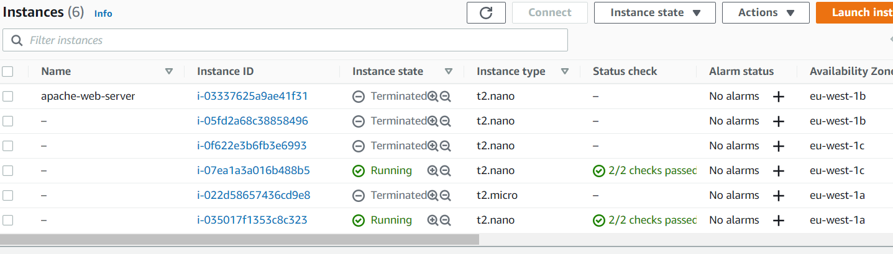

If terminating those two as well, new two are created so webserver can still work.
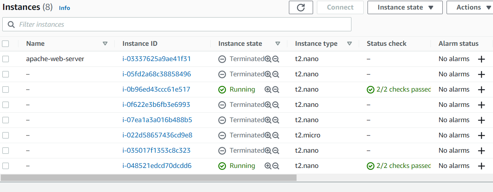

**Q614. How are you going to end this section regarding the use of AWS resources?**
In order to free the resources, all instances need to be deattached from the autoscaling group. The minimum capacity needs to be set to 0 in order to do that and instances need to be in service or standby state. Two new instances are then created as replacement - but they are not longer in the autoscaling group and can be terminated.

**Q615. Create a piece of code (Python or bash) to reproduce the above steps required to launch a new set of web servers with a load balancer. Start using the AMI that you have already created.**

## Task 6.2: Serverless example

To create a serverless example, we first create a DynamoDB table `shopping-list`. There is only one column, which is the primary key, and it is named `thingid` to later match with the scripts.

Then we create a Lambda function named `serverless-controller` with DynamoDB permissions.

With this Lambda function, we add an open API Gateway trigger running with Python 2.7 and a custom ``boto3`` code. When set up, we are ready to ``deploy`` this function and check whether it successfully connects with the DB through the link

`https://lwyjgabyl4.execute-api.eu-west-1.amazonaws.com/default/serverless-controller?TableName=shopping-list`

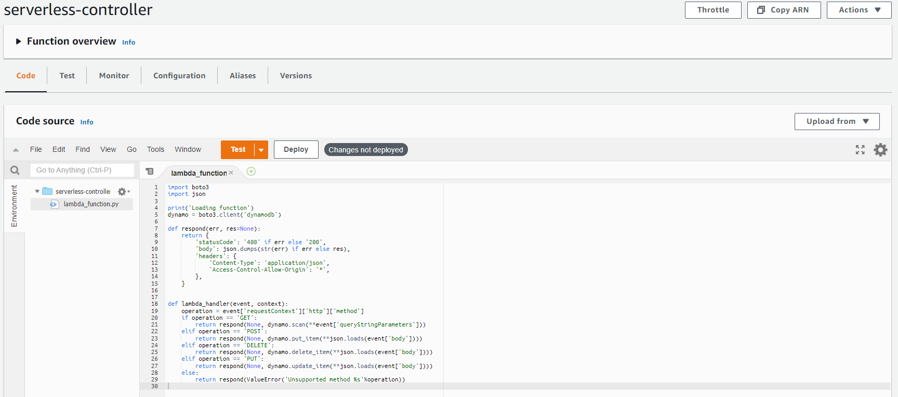

**Q621. What is the list of events that the above URL triggers?**

````json
{
    "Count": 3,
    "Items": [],
    "ScannedCount": 3,
    "ResponseMetadata": {
        "RetryAttempts": 0,
        "HTTPStatusCode": 200,
        "RequestId": "R9HPJ6V4EVR240VC1COH3O1TP3VV4KQNSO5AEMVJF66Q9ASUAAJG",
        "HTTPHeaders": {
            "x-amzn-requestid": "R9HPJ6V4EVR240VC1COH3O1TP3VV4KQNSO5AEMVJF66Q9ASUAAJG",
            "content-length": "104",
            "server": "Server",
            "connection": "keep-alive",
            "x-amz-crc32": "1728079166",
            "date": "Thu, 08 Apr 2021 17:21:51 GMT",
            "content-type": "application/x-amz-json-1.0"
        }
    }
}
````

**Q622. Does the reply of the above URL match what it should be expected? Why?**

Yes, the results gathererd from the DynamoDB table are the expected. It shows all the entries at that moment, an HTTP status code ``200``, which means *OK success status*, a request ID that changes everytime we make a new request, and some other HTTP headers, used by boto3 internally.

After configuring the IAM Policy role and creating an S3 bucket to store the static website, we can properly access the endpoint URL, as well as check what items are stored in the table and adding new items by accessing the S3 URL `http://task62-static-website.s3-website-eu-west-1.amazonaws.com/`:


The DynamoDB table shows the results as well:

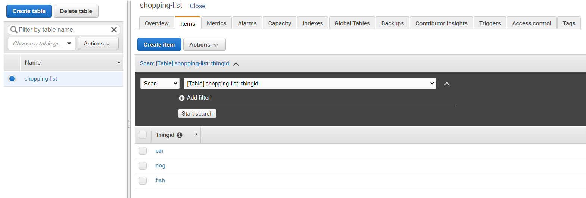

**Q623. Explain what happens (actions and parts activated) when you type the URL in your browser to obtain the page updated with the shopping list.**

The S3 endpoint URL accesses the files previously uploaded (`index.html`, `scrip.js`, and `styles.css`). The HTML index shows the elements of the shopping list, which are stored on the DynamoDB table. To this end, the script makes a `GET` request and, if successful, it iterates over the column `thingid` of the table to gather all the items and prints them on screen.

**Q624. Explain what happens (actions and parts activated) when you type a new item in the New Thing box.**

The HTML index has a box named `thingid` which lets users add a new element in the shopping list. This class is managed by the script, which sends through Lambda the `POST` request. Lambda has a Python script with a function named `lambda_handler` which has previously granted permissions to read, write and update items.

**Q625. Have you been able to debug the code of the Lambda function? If the answer is yes, check that you are using the root API keys. Erase such keys and create a new testing user with the required permissions.**

The provided code on `lambda.py` successfully retrieved the query.:

````json
Loading function
--------------------GET event test
--------------------REQUEST
{
  "requestContext": {
    "http": {
      "method": "GET"
    }
  },
  "queryStringParameters": {
    "TableName": "shopping-list"
  }
}
--------------------RESULT
{
  "statusCode": "200",
  "body": "{\"Items\": [{\"thingid\": {\"S\": \"car\"}}, {\"thingid\": {\"S\": \"dog\"}}, {\"thingid\": {\"S\": \"fish\"}}], \"Count\": 3, \"ScannedCount\": 3, \"ResponseMetadata\": {\"RequestId\": \"NN18667AKI7JVHSN9IBJNQACDFVV4KQNSO5AEMVJF66Q9ASUAAJG\", \"HTTPStatusCode\": 200, \"HTTPHeaders\": {\"server\": \"Server\", \"date\": \"Sun, 11 Apr 2021 15:53:47 GMT\", \"content-type\": \"application/x-amz-json-1.0\", \"content-length\": \"111\", \"connection\": \"keep-alive\", \"x-amzn-requestid\": \"NN18667AKI7JVHSN9IBJNQACDFVV4KQNSO5AEMVJF66Q9ASUAAJG\", \"x-amz-crc32\": \"1234584460\"}, \"RetryAttempts\": 0}}",
  "headers": {
    "Content-Type": "application/json",
    "Access-Control-Allow-Origin": "*"
  }
}
--------------------RESULT body
{
  "Items": [
    {
      "thingid": {
        "S": "car"
      }
    },
    {
      "thingid": {
        "S": "dog"
      }
    },
    {
      "thingid": {
        "S": "fish"
      }
    }
  ],
  "Count": 3,
  "ScannedCount": 3,
  "ResponseMetadata": {
    "RequestId": "NN18667AKI7JVHSN9IBJNQACDFVV4KQNSO5AEMVJF66Q9ASUAAJG",
    "HTTPStatusCode": 200,
    "HTTPHeaders": {
      "server": "Server",
      "date": "Sun, 11 Apr 2021 15:53:47 GMT",
      "content-type": "application/x-amz-json-1.0",
      "content-length": "111",
      "connection": "keep-alive",
      "x-amzn-requestid": "NN18667AKI7JVHSN9IBJNQACDFVV4KQNSO5AEMVJF66Q9ASUAAJG",
      "x-amz-crc32": "1234584460"
    },
    "RetryAttempts": 0
  }
}
--------------------POST event test
--------------------REQUEST
{
  "requestContext": {
    "http": {
      "method": "POST"
    }
  },
  "body": "{\"TableName\":\"shopping-list\",\"Item\":{\"thingid\":{\"S\":\"Red apples\"}}}"
}
--------------------RESULT
{
  "statusCode": "200",
  "body": "{\"ResponseMetadata\": {\"RequestId\": \"U9QN157G4I0AQ7S922TNEGKUNVVV4KQNSO5AEMVJF66Q9ASUAAJG\", \"HTTPStatusCode\": 200, \"HTTPHeaders\": {\"server\": \"Server\", \"date\": \"Sun, 11 Apr 2021 15:53:48 GMT\", \"content-type\": \"application/x-amz-json-1.0\", \"content-length\": \"2\", \"connection\": \"keep-alive\", \"x-amzn-requestid\": \"U9QN157G4I0AQ7S922TNEGKUNVVV4KQNSO5AEMVJF66Q9ASUAAJG\", \"x-amz-crc32\": \"2745614147\"}, \"RetryAttempts\": 0}}",
  "headers": {
    "Content-Type": "application/json",
    "Access-Control-Allow-Origin": "*"
  }
}
--------------------RESULT body
{
  "ResponseMetadata": {
    "RequestId": "U9QN157G4I0AQ7S922TNEGKUNVVV4KQNSO5AEMVJF66Q9ASUAAJG",
    "HTTPStatusCode": 200,
    "HTTPHeaders": {
      "server": "Server",
      "date": "Sun, 11 Apr 2021 15:53:48 GMT",
      "content-type": "application/x-amz-json-1.0",
      "content-length": "2",
      "connection": "keep-alive",
      "x-amzn-requestid": "U9QN157G4I0AQ7S922TNEGKUNVVV4KQNSO5AEMVJF66Q9ASUAAJG",
      "x-amz-crc32": "2745614147"
    },
    "RetryAttempts": 0
  }
}
````

**Q626. What are the minimum permissions that the user's API keys needs to execute the Lambda function locally?**

In order to work with the DB more safely, a new user with restricted permissions can be created on the IAM Management Console. The permission `AmazonDynamoDBFullAccess` has to be granted to perform all the operations needed by the scripts.

**Q627. Create a piece of code (Python or bash) to reproduce the above steps required to launch a new AWS Lambda function and AWS API gateway.**

Using the terminal, the same Lambda function can be created with the following commands:

````bash
aws iam create-role --role-name <name> --assume-role-policy-document "{"Version": "2012-10-17","Statement": [{ "Effect": "Allow", "Principal": {"Service": "lambda.amazonaws.com"}, "Action": "sts:AssumeRole"}]}"
````

The necessary policies can be attached with:

````bash
aws iam attach-role-policy --role-name <name> --policy-arn arn:aws:iam::aws:policy/service-role/AmazonDynamoDBFullAccess
````

Then we can move to the created function with `cd`. Once there, we can upload a compressed script with:

````bash
aws lambda create-function --function-name <name> --zip-file fileb://lambda.zip --handler lambda_function.lambda_handler --runtime python3.7 --role arn:aws:iam::<account id>:role/lambda-ex
````
