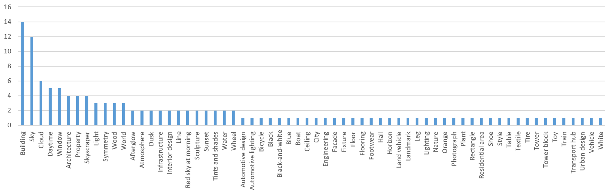

# Lab session #8: Advanced Analytics as a Service in the Cloud

## About

**Course**  
Cloud Computing and Big Data Analytics  (CCBDA-MIRI)  
FIB - Universitat Politècnica de Catalunya. BarcelonaTech  
April 2021

**Team**  
* Andreas Kieslinger
&lt;andreas.kieslinger@estudiantat.upc.edu&gt;
* Marcel Cases
&lt;marcel.cases@estudiantat.upc.edu&gt;

## Task 8.1: Google Cloud Vision

We register Google Cloud Platform and create a new project using **Cloud Vision API**. We download Google's `cloud-vision` example from their repo and we set up the authentication keys.

We want to run an example, so we create a Conda environment and we install all dependencies specified in `requirements.txt`. We pass a randomly chosen image through `label.py` and we get a list of 5 guesses made by Cloud Vision, sorted by their accuracy, and we check that we obtain ther expected results.

Now we want to do a hands-on experiment with real images gathered from Flickr. We write a script `flickr_img_getter.py` that collects images from a search query, in this case, `https://www.flickr.com/search/?text=barcelona`. After running it, we have collected 26 images labeled as `Barcelona`. They are stored at `image_cache/`. After that, we run the script `ImageAnalyzer.py` to analyse these images on Cloud Vision, and we get their classification (first five labels) and accuracy (stored on `google_cloud_results.txt`) for each one of the processed images.

After we have all these data ready, we analyze it by creating a chart as shown below:

From the chart we conclude that the most common terms recognized in images from Barcelona are those **related with architecture** (building, window, architecture -itself-, property, skyscraper, light, ...). The second most common group of words is **related with weather and environment** (sky, daytime, light, atmosphere, dusk, ...). All these results make sense in the case of Barcelona.

**Q81: What problems have you found developing this section? How did you solve them?**

* I forgot to bring my credit-card credentials to class, so I could not immediately start.

* Creating credentials harder to find as the website layout has changed. One can create many types of keys, which are not the key we actually want. One needs to go to IAM & Admin section first, and there create the key we need. One can create a service account and keys for that in the settings-branch of the project, but no .json is created there, that was confusing.

* Cloud Vision API was blocked/ not enabled for my bucket

* On Flickr, the last 100 images included many duplicates. Consequently, we purged all duplicates, so we have a better dataset, but not 100 images.

* In the quickstart guide, the API-explorer did not work, so I could not test the demo. As I was running the newest version of chrome and ubuntu, the hint that I might use outdated browser/OS versions did not help me.

**Q82: How long have you been working on this session? What have been the main difficulties you have faced and how have you solved them?**

The lab session took us two afternoons + an evening. The most complex part has been writing scripts to gather data from Flickr, as Twitter was discarded for this project. The data analysis was pretty straightforward, as there were not a huge amount of results to process.
